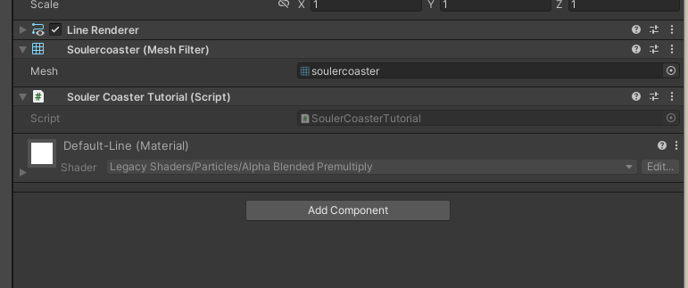
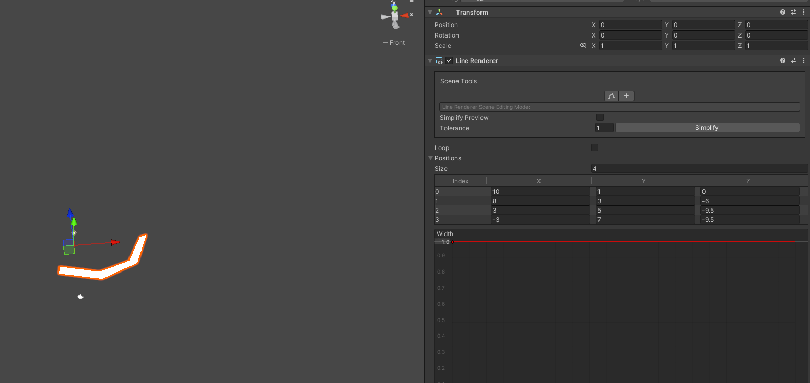
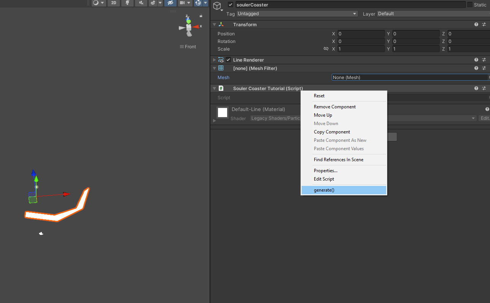
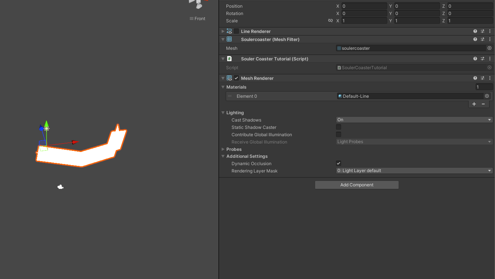
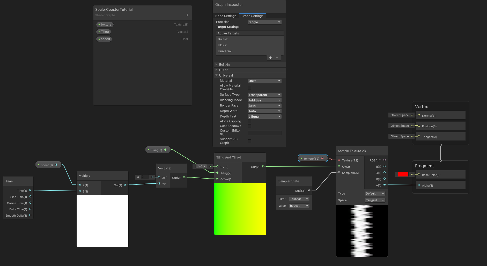
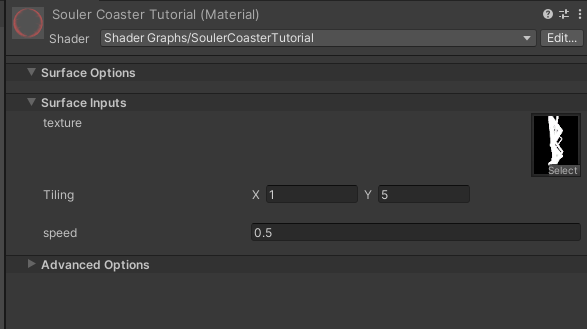
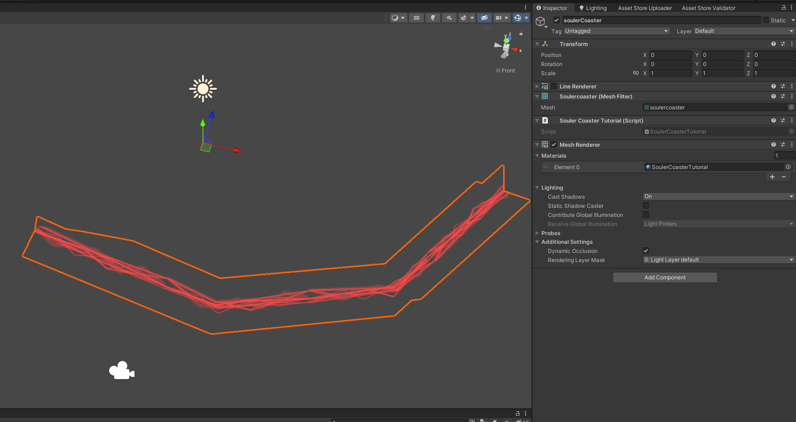

# Generating a SoulerCoaster in Unity

If you search for SoulerCoaster, you will find a multitude of names for it.
It is also named Curvemesh, Splinemesh, or Swoosh.

They describe a technique to visualize magic or energetic effects.

# The SoulerCoaster is a path mesh with an overlapping UV map.


It is defined as two quads that are oriented orthogonal to each other.
They share the same UV space.
So a texture appearing on the vertical quad also appears the same on the horizontal quad.


We can now scroll the texture over these quads to generate a moving effect.

# We generate the SoulerCoaster as two planes aligned orthogonal to each other.
Previously, I used Blender for better visualization.
Now, we will switch to Unity.
We will use the LineRenderer component to store the path of our SoulerCoaster.

We will start by creating a new file `SoulerCoasterTutorial.cs`.
```c#
// We need a LineRenderer for the path and a MeshFilter to store the created mesh
[RequireComponent(typeof(LineRenderer), typeof(MeshFilter))]
public class SoulerCoasterTutorial : MonoBehaviour {
    // ContextMenus can be called through right-click on the component in the inspector
    [ContextMenu("generate()")]
    public void generate() {
        // Retrieve the path from the LineRenderer
        var positions = new Vector3[GetComponent<LineRenderer>().positionCount];
        GetComponent<LineRenderer>().GetPositions(positions);

        // Holds the vectors
        List<Vector3> vectorList = new();
        // Holds the triangle faces
        List<int> triangleList = new();
        // Holds the UV map
        List<Vector2> uvCoordinates = new();

        // First we push the vertical plane
        var nextIndex = pushQuadPlane(0, positions, vectorList, uvCoordinates, triangleList, 0);
        // Second we push the horizontal plane
        pushQuadPlane(nextIndex, positions, vectorList, uvCoordinates, triangleList, 90);

        // Create the mesh and assign it
        var mesh = new Mesh {
            name = "soulercoaster",
            vertices = vectorList.ToArray(),
            uv = uvCoordinates.ToArray(),
            triangles = triangleList.ToArray()
        };
        GetComponent<MeshFilter>().mesh = mesh;
    }
    
    private static int pushQuadPlane(int startIndex, Vector3[] positions, List<Vector3> vectorList, List<Vector2> uvCoordinates,
    // Shown Below
    }
}
```
That is just the calling construct for the real mesh generator.

Let's have a look at the `pushQuadPlane` method.
I fear it's rather long, but it consists mostly of comments
```c#
private static int pushQuadPlane(int startIndex, Vector3[] positions, List<Vector3> vectorList, List<Vector2> uvCoordinates,
    List<int> triangleList,
    int rotate) {
    var currentPosition = positions[0];
    var deltaDirection = positions[1] - currentPosition;
    // Find an orthogonal vector to the path and rotate it around the given rotation (0 for horizontal, 90 for vertical)
    var quadDirection = Quaternion.AngleAxis(rotate, deltaDirection) * Vector3.Cross(currentPosition, deltaDirection).normalized;

    // Push initial quads
    vectorList.Add(currentPosition + quadDirection);
    vectorList.Add(currentPosition - quadDirection);
    // Start at the bottom of the UV map
    uvCoordinates.Add(new Vector2(0, 0));
    uvCoordinates.Add(new Vector2(1, 0));
    var lastPosition = currentPosition;

    // We need the starting Index so the triangles can reference the correct vectors
    var i = startIndex + 1;

    // Iterate over all positions to create the quad
    // Each iterations adds two new vectors that build a quad with the previous two vectors.
    // That is the reason we need to push the initial quads without faces
    while (i - startIndex < positions.Length) {
        currentPosition = positions[i - startIndex];
        deltaDirection = currentPosition - lastPosition;

        // Find an orthogonal vector to the path and rotate it around the given rotation (0 for horizontal, 90 for vertical)
        quadDirection = Quaternion.AngleAxis(rotate, deltaDirection) * Vector3.Cross(currentPosition, deltaDirection).normalized;
        vectorList.Add(currentPosition + quadDirection);
        vectorList.Add(currentPosition - quadDirection);
        
        // Calculate the progress along the UV map
        var progress = (i - startIndex) / (positions.Length * 1f);
        uvCoordinates.Add(new Vector2(0, progress));
        uvCoordinates.Add(new Vector2(1, progress));

        // Build the quad face from two triangles
        // I think this is the most complicated part.
        // Each mesh consists of triangles. A triangle is defined by pushing 3 entries onto the triangle array.
        // These 3 vectors need to be in clockwise order or they will be interpreted as backfaces.
        
        // Push the lower right vector
        triangleList.Add(i * 2 - 2);
        // Push the lower left vector
        triangleList.Add(i * 2 - 1);
        // Push the upper right vector
        triangleList.Add(i * 2);

        // Push the lower left vector
        triangleList.Add(i * 2 - 1);
        // Push the upper left vector
        triangleList.Add(i * 2 + 1);
        // Push the upper right vector
        triangleList.Add(i * 2);

        lastPosition = currentPosition;
        i++;
    }

    return i;
}
```
All referenced files are available at the end of the article.

## We generate the mesh along the path of a LineRenderer.
At first, we need to add the SoulerCasterTutorial component to a GameObject.


> If you can't select the component, you either have a compile error somewhere, or the filename does not match the classname.

That adds the **LineRenderer** and **MeshFilter** components to the GameObject.
Now we fill the LineRenderer with a path:


We can now right-click on the **SoulerCoasterTutorial** component and choose `generate`.

If everything works, we see, that the MeshFilter has a new mesh assigned to it. 

Now, we need to add a **MeshRenderer** component and assign a Material.

We can see the two quads standing on top of each other.
To animate this mesh with a texture we need to create a new Shader.
To build this shader we will use Unity **ShaderGraph**.

## The shader scrolls over the provided texture.

We want to create a transparent additive Shader that renders on both sides of the faces.
You can change these settings in the `Graph Inspector`.

We start with a `Time`-Node and multiply it by our `speed` variable.
With this value, we create an offset vector2 for the `Tiling and Offset`-Node.
That node takes the offset and the `Tiling` variable to stretch and scroll over the provided texture.
We take the modified UV and funnel it into the `Sample Texture 2D`-Node. 
You can find the used texture referenced at the end of this tutorial.
This node also takes a `SamplerState` to set some parameters for the texture.
The output of this node will go straight into the Alpha Output node.

The whole `.shadergraph` file is attached at the bottom.

## Finally, We create a material and assign the created Shader.


We assign the texture and set tiling and speed.
The y-tiling is higher than the x-tiling because the mesh has more length than width.

We assign the created material to the `MeshRenderer` component to see the result.


## Wrapping up
The hardest part is the mesh generation.
This covers only the basic use cases.
Some paths won't be possible with this algorithm.
For the sake of simplicity, I omitted the implementation of edge cases.

Here are all the resources used in the tutorial:
- [SoulerCoasterTutorial.cs](SoulerCoasterTutorial.cs)
- [SoulerCasterTutorial.shadergraph](SoulerCasterTutorial.shadergraph)
- [texture.png](texture.png)

If you don't want to implement the SoulerCoaster on your own, you can use this Unity package.
It contains a sophisticated mesh generator, several geometric path generators, and the needed shaders.

You can find it on Artstation: 

I also plan to release it in the Unity Assetstore.
Sadly, the reviewing of a package can be measured in months so it will take some time till it is live there.
